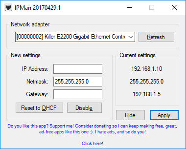

# IPMan

Are you tired of going through 3 windows and fighting with Windows's clunky IP input interface to change your adapter's IP? Me too!, and while there are powerful PowerShell scripts out there to do so, I'm not very fond of the CLI... I just wanted to make a simple app where I could select my network adapter, change the most common parameters and click a button, that's it!. 

Since I couldn't find any, I rolled my own, then I decided to share it with you all, for FREE\*! :)

### Is this app useful for you? Consider becoming my patron! :D

**Latest version:** 

[Download for x86 (32-bit)](https://github.com/darkguy2008/IPMan/releases/download/20170429.1/x86.IPMan.x86.20170429.1.zip)

[Download for x64 (64-bit)](https://github.com/darkguy2008/IPMan/releases/download/20170429.1/x64.IPMan.x64.20170429.1.zip)

  
  
Screenshot:

  

Created by DARKGuy
